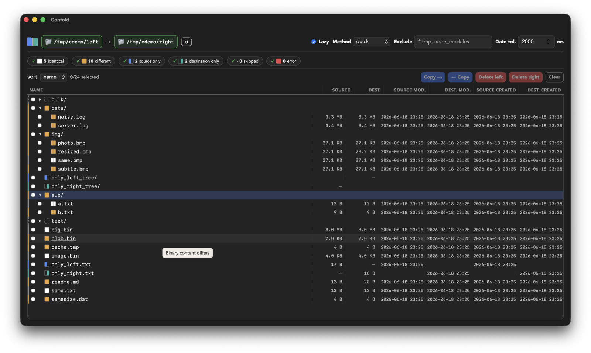
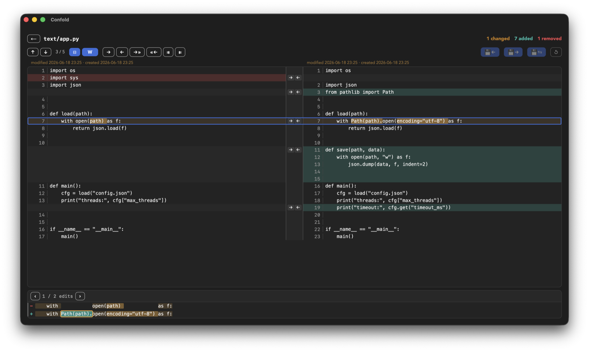
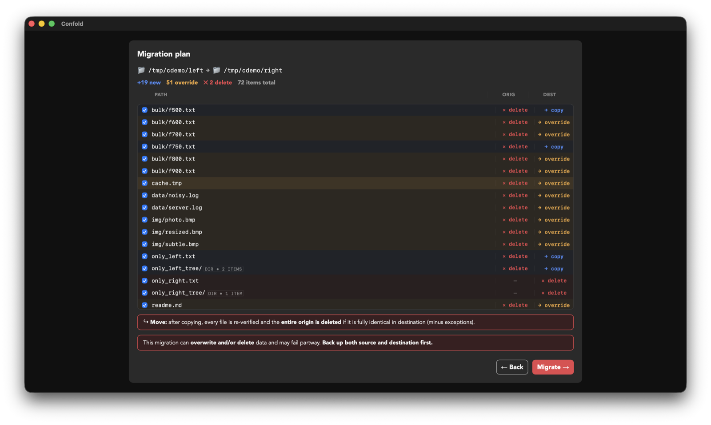
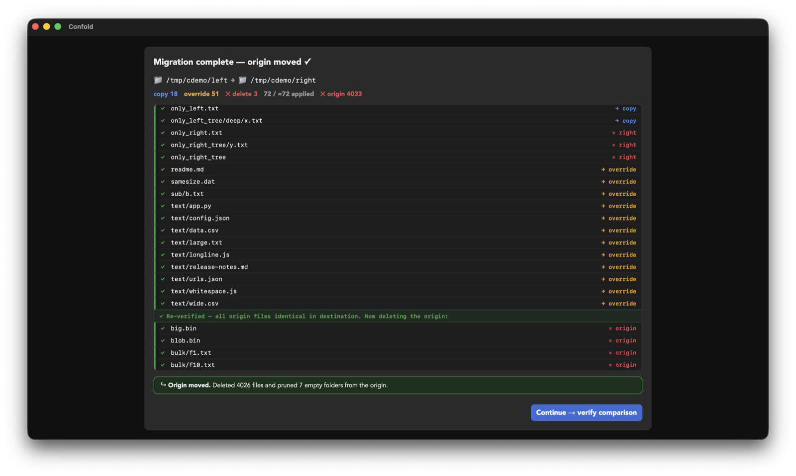
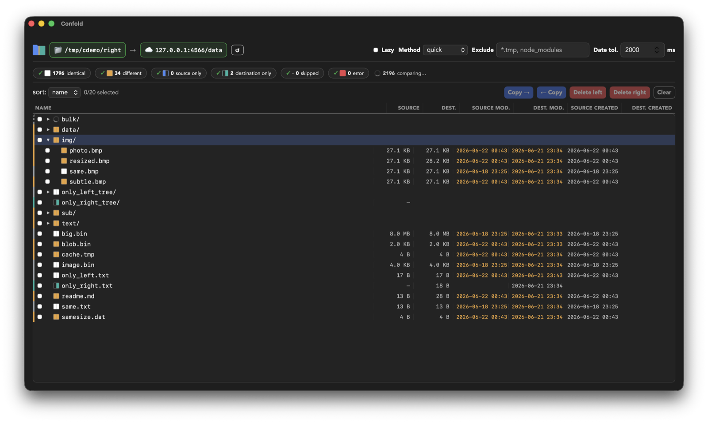

<div align="center">


# Confold

### Compare anything. Move what matters.

**Confold** is a fast, keyboard-driven folder & file comparison tool for **Linux, macOS and Windows**.
Diff local and remote trees side by side, then **migrate** or **reconcile** them — streaming huge files,
never waiting for a full scan, never loading what it doesn't need.


*Free and open source · Apache-2.0*

</div>

---

> **v0.6.0 is out.** Install with your package manager (see [Install](#install)) or grab a build from the
> [latest release](https://github.com/confold/confold/releases/latest).

## Three modes, one engine

- **🔍 Compare** — explore differences manually: a virtualized, lazy folder tree with live status counts,
  word/character-level side-by-side diffs, hunk navigation, and copy/delete on individual files.
- **🔁 Migrate** — reconcile a destination to match a source (copy new / overwrite different / delete
  extra), with a dry-run **plan**, per-item checkboxes, a read-only review, and a **streaming, cancellable,
  per-file** apply with live progress — then a verify re-compare.
- **🔀 Sync** — bidirectional reconciliation with conflict resolution, on the same engine as Migrate.

### Move, not just copy — safely

Migrate can **delete the origin after the copy**, but only after a **full byte-compare re-verification**
confirms *every* file landed intact in the destination — and it's **all-or-nothing**: if a single file
isn't verified identical, nothing is deleted. A partial move can never strand your files.

## Why it's fast

- **Never waits.** The window shows the top level the instant you hit Compare and fills in as you explore —
  no "scan everything first." Folders you never open are never compared.
- **Streams huge files** in 64 KiB windows instead of loading them into memory, and a byte compare **stops
  at the first difference**.
- **Zero re-scan method switch.** Already compared with `full`? Switching to `quick` / `size` / `mtime`
  re-derives verdicts instantly from data already in memory.
- **Big files, handled honestly.** Above the in-memory cap, Confold shows the **differences only** (changed
  regions with context, like `git diff`), scanned in bounded blocks; big binaries open in a hex view. No
  silent truncation.

## See it in action

**Compare** — a lazy folder tree with live status pills, counts and a status filter:



**Side-by-side diff** — word- and character-level highlighting, hunk navigation, copy ↔:



**Migrate plan** — a dry-run with per-item checkboxes and copy / override / delete reasons:



**Verified move** — re-verify every byte landed, then empty the origin (all-or-nothing):



**Compare anything** — local, SFTP and S3 on the same engine:



## Right-click to compare (macOS)

Enable **Folder right-click integration** in the app, then:

1. Right-click a folder in Finder → **Confold Select Origin**
2. Right-click another folder → **Confold Compare**

Confold launches with both folders loaded and the comparison running automatically.
Menu items adapt dynamically — once you've selected an origin, the destination menu
changes to "Compare" so you know the next step.

Recently compared folders are remembered across restarts, and deleted paths are
highlighted in red so you can fix them before comparing.

> Linux and Windows shell integration are on the roadmap.

## Sources

| Source | Status |
|---|---|
| **Local filesystem** | ✅ |
| **SFTP** | ✅ pure-Rust (`russh`) — no OpenSSL/C |
| **S3 / S3-compatible** | ✅ AWS, MinIO, R2, … (`object_store`, pure-Rust) |
| SMB · NFS · WebDAV · cloud drives | 🛣️ roadmap |

Sources are **capability-gated plugins** behind one uniform interface, so every backend lights up the
*same* fast compare / migrate / sync engine.

## Install

Pick your platform — or download a build (`.dmg`, `.msi`/`.exe`, `.deb`/`.rpm`/`.AppImage`) from the
[latest release](https://github.com/confold/confold/releases/latest).

**macOS** — Homebrew:

```sh
brew tap confold/confold
brew install --cask confold
```

**Windows** — winget, Scoop or Chocolatey:

```powershell
winget install Confold.Confold
# or:  scoop bucket add confold https://github.com/confold/scoop-confold && scoop install confold
# or:  choco install confold
```

**Linux** — the `.deb`, `.rpm` or `.AppImage` from the
[latest release](https://github.com/confold/confold/releases/latest), or via Homebrew:

```sh
brew install confold/confold/confold
```

> **macOS:** the app is ad-hoc signed but not notarized. On first launch macOS blocks it — go to
> **System Settings → Privacy & Security** and click **Open Anyway**. (If you somehow see
> *"damaged and can't be opened"* instead, run `sudo xattr -rd com.apple.quarantine /Applications/Confold.app`.)
>
> **Windows:** click **More info → Run anyway** when SmartScreen prompts.
>
> Package-manager availability rolls out per channel — winget and Chocolatey may lag a few days behind a release while they clear moderation.

### Build from source

**Requirements:** [Rust](https://rustup.rs) (1.96+), [Node + pnpm](https://pnpm.io), and the Tauri v2
system webview deps for your OS (macOS: Xcode CLT; Linux: `libwebkit2gtk-4.1-dev`, `libgtk-3-dev`,
`librsvg2-dev`, build-essential; Windows: WebView2).

```sh
git clone https://github.com/confold/confold.git
cd confold/confold-app
pnpm install
pnpm tauri dev      # run the desktop app
pnpm tauri build    # build a packaged app for your platform
```

There's also a headless **CLI** for scripting and CI:

```sh
cargo build --release                       # binary at target/release/confold
confold compare path/to/left path/to/right --method full --exclude '*.tmp'
```

Markers: `=` identical · `~` different · `<` left-only · `>` right-only · `.` skipped · `!` error.
Useful flags: `--method full|quick|size|mtime|size-mtime`, `--include/--exclude <glob>`,
`--format text|json`, `--no-recursive`, `--fail-on-diff` (exit 1 on any difference).

### Semantic document compare and merge

The current source tree includes semantic protocol v1 for AI-assisted comparison of two Markdown or
plain-text variants, with an optional common base. Confold owns input snapshots, SHA-256 validation,
deterministic review diffs and safe output creation; the agent only proposes meaning-level decisions.

This is useful today for people who already work with an AI coding or document agent: Confold adds a
provider-neutral, fail-closed boundary around a task that an agent would otherwise perform with
unvalidated reads and writes. Deterministic fast paths avoid model work when the answer is already
clear, while ambiguous prose reaches the agent as a bounded, versioned bundle.

Confold itself does not invoke or configure an LLM. The user's agent runtime supplies the model and
writes only a proposal; Confold validates that proposal, rechecks every input, shows deterministic
diffs and creates a separate output after explicit confirmation. Whether document content leaves the
machine therefore depends on the selected agent runtime and its provider. The desktop UI does not yet
expose this workflow; desktop resolver and provider configuration remain roadmap work.

```sh
confold capabilities --format json

confold semantic prepare \
  --left draft-a.md --right draft-b.md --base common.md \
  --output bundle.json

# An agent using skills/confold writes proposal.json, then Confold validates it:
confold semantic review \
  --bundle bundle.json --proposal proposal.json --format json

# Apply always creates a separate output and never overwrites an input or existing file:
confold semantic apply \
  --bundle bundle.json --proposal proposal.json \
  --output merged.md --format json
```

Both review and apply re-read every input and reject a stale bundle. Binary files, invalid UTF-8,
source code and structured configuration are outside protocol v1. The companion public agent skill is
in [`skills/confold`](skills/confold).

Generate a ready-to-use three-way prose fixture alongside the normal demo trees:

```sh
scripts/gen-demo.sh /tmp/confold-demo

confold semantic prepare \
  --base /tmp/confold-demo/semantic/base.md \
  --left /tmp/confold-demo/semantic/left.md \
  --right /tmp/confold-demo/semantic/right.md \
  --output /tmp/confold-demo/semantic-bundle.json
```

The left variant adds audit evidence, the right variant adds stale-plan and no-overwrite gates, and
both retain the base rollback intent. This makes omissions visible during proposal review.

## Architecture

A strict dependency layering (frontend → engine → VFS) keeps the engine reusable and the backends
pluggable:

| Crate | Role |
|---|---|
| [`confold-vfs`](crates/confold-vfs) | The `Source`/`SourceMut` (VFS) traits + `LocalSource`. The engine never touches `std::fs` directly. |
| [`confold-core`](crates/confold-core) | The compare engine: walk + match, metadata triage, content compare, result model + renderers. |
| [`confold-semantic`](crates/confold-semantic) | Versioned AI proposal protocol, stable input fingerprints, review diffs, stale-input rejection and atomic create-new output. |
| [`confold-sftp`](crates/confold-sftp) · [`confold-s3`](crates/confold-s3) | Remote source backends (SFTP, S3) — pure-Rust, no native deps. |
| [`confold-cli`](crates/confold-cli) | The `confold` command-line frontend. |
| [`confold-app`](confold-app) | The Tauri v2 + Svelte 5 desktop GUI. |

Developed **clean-room** — third-party GPL tools are consulted only as behavioural references and test
oracles; no GPL code is ever copied into this project. See [`AGENTS.md`](AGENTS.md) for how the project is
built, and the layered [testing strategy](AGENTS.md) (typed command bindings, component tests, Playwright
visual smokes, and in-process SFTP/S3 hermetic harnesses — no Docker).

## Roadmap

- **More sources** — SMB, NFS, WebDAV, cloud drives, on the same engine.
- **Desktop semantic reconciliation** — connect the validated CLI + skill protocol to file-level GUI
  actions and unresolved Sync conflicts.
- **Signed & notarized builds** — code-signing for macOS and Windows to drop the install-time prompts.
- **Confold Cloud** — a hosted "reconcile and sync across sources, from one place" service (later).

## Contributing

Issues and PRs welcome. Run the quality gates before submitting:

```sh
cargo test --all && cargo lint && cargo fmt --all --check     # engine + CLI
cd confold-app && pnpm test && pnpm check                     # GUI (vitest + svelte-check)
```

## Support

Confold is free and open source. If it saves you time, a small one-time thank-you keeps development moving —
[Ko-fi](https://ko-fi.com/juanyque) · [GitHub Sponsors](https://github.com/sponsors/juanyque).

## License

[Apache-2.0](LICENSE).
